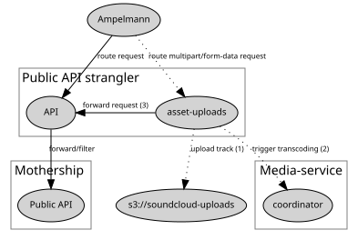

# asset-uploads

This is a `public-api-strangler` component that preprocesses, rewrites and
forwards `multipart/form-data` requests.

Specifically this component handles:

  * Consistent propagation of OAuth token in `Authorization` HTTP header
  * Spooling track uploads to S3 directly

## Overview



## Example

Upload the track at `/path/to/my_track.wav` as a private track.

```
curl -vi -XPOST \
-F "oauth_token=$OAUTH_TOKEN" \
-F "track[asset_data]=@/path/to/my_track.wav" \
-F "track[sharing]=private" \
-F "track[title]=My Track" \
-H "Host: api.soundcloud.com" \
-H "X-Track-Asset-Uploads: true" \
http.asset-uploads-api.prod.public-api.srv.db.s-cloud.net/tracks
```

To use chunked transfer mode (where we don't tell the server how big the file is going to be upfront), add `-H "Transfer-Encoding: chunked"`.

By default, the tracks are not uploaded to S3 directly but passed through to Mothership.
To enable direct-to-S3 uploads, add `-H "X-Track-Asset-Uploads: true"'.
