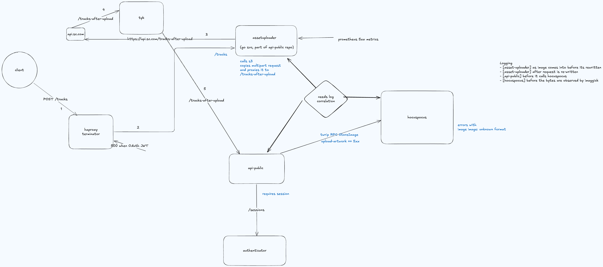
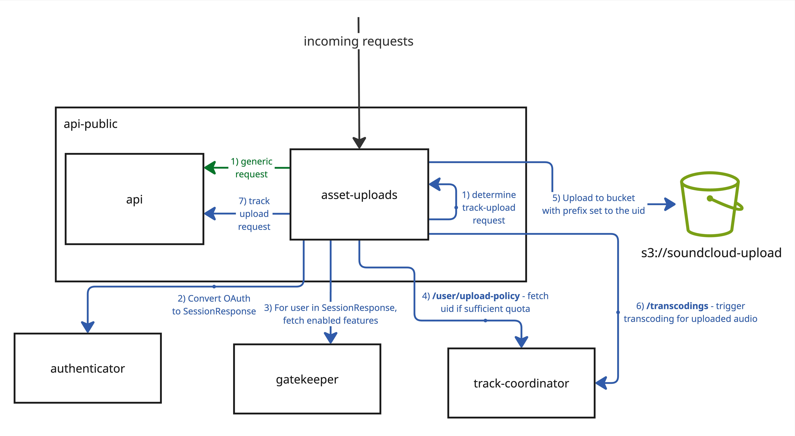

# asset-uploads

This is a `api-public` component that preprocesses, rewrites and forwards ALL `multipart/form-data` requests. 
Even if a route does not exist for the given endpoint, the request is forwarded as is to the `api` component.


([Source](https://excalidraw.com/#json=hqqViP6NX7hkIF3n2ISQA,x6fi7ezLHbCQ4b0loaaUJQ))

Additionally, the component is responsible for:

  * Consistent propagation of OAuth token in `Authorization` HTTP header
  * Validating the upload quota for the uploading user
  * Spooling track uploads to S3 directly
  * Triggering the audio transcoding process on the S3 upload has complete

## Overview

This diagram/description demonstrates the desired integrations once [PLAYBACK-8734](https://soundcloud.atlassian.net/browse/PLAYBACK-8734) is complete:


([Source](https://miro.com/app/board/uXjVJVa0Qig=/?moveToWidget=3458764637006541791&cot=14))


- Incoming requests to asset-uploads do not have `SC-` headers populated (where these are later created with the
`created_session` plugin in Tyk; it is not possible to call Tyk before asset-uploads as there are issues calling Tyk
with large audio files)
- To be able to send requests to internal systems (i.e. track-coordinator) that create a `LoggedInUserSession` from the
`SC` headers, we need to call both authenticator and gatekeeper to fetch the Session and Features information
- Once the `SC` headers have been obtained, we call `/user/upload-policy` in track-coordinator to generate a user policy,
including an upload id (known as an uid) for the upload
- Using this uid as the key we upload the audio content to S3
- Once the audio is in S3 we call track-coordinator again to start the process of generating transcodings for the audio
- The initial request (now modified with additional upload information including the original filename and uid) is 
forwarded to the api-public api component, which will create the track object

## Example
Upload the track at `/path/to/my_track.wav` as a private track.

```
curl -vi -XPOST \
-F "oauth_token=$OAUTH_TOKEN" \
-F "track[asset_data]=@/path/to/my_track.wav" \
-F "track[sharing]=private" \
-F "track[title]=My Track" \
-H "Host: api.soundcloud.com" \
http.asset-uploads-api.prod.api-public.srv.db.s-cloud.net/tracks
```

To use chunked transfer mode (where we don't tell the server how big the file is going to be upfront), add `-H "Transfer-Encoding: chunked"`.

More information on how to test locally can be found in [CONTRIBUTING.md](../CONTRIBUTING.md#asset-uploads-and-api-public-in-dockerized-containers)
